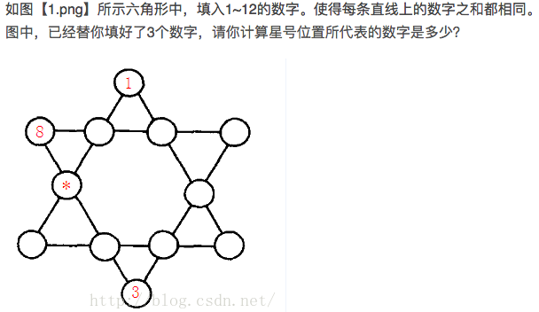
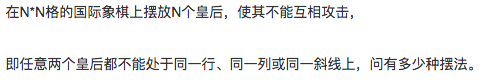
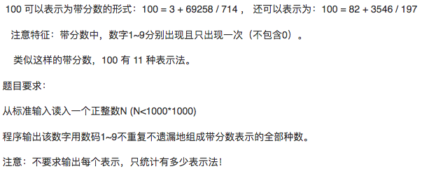
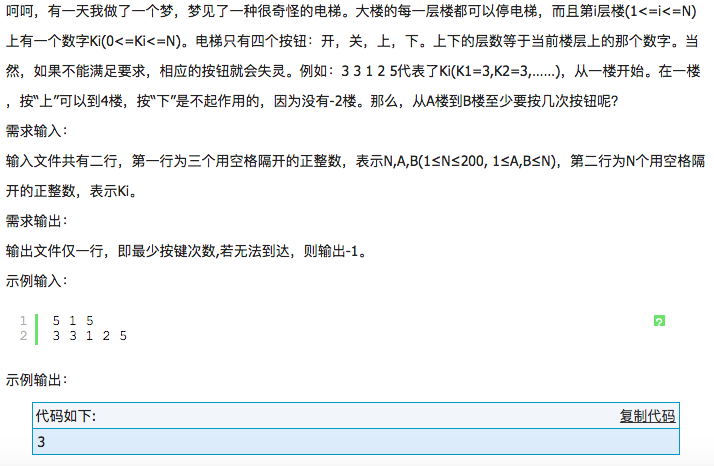

记录深度优先搜索学习过程中的典型例题和思想：

1、六角填数：


思路就是蛮力的穷举各种可能，第一次在第三个位置填上数字2，然后递归调用dfs，如果最终ok，则完成。如果不行，则回收数字2，填上数字3，依次递归调用dfs。直到最终满足约束条件，所有边的和相等。最后求出，填入10可以。

2、N皇后：


把每一列皇后的位置存于数组中，数组的值就是皇后在一列中的位置，只需要比较每两个皇后是否在同一行或者对角线上即可！

3、带分数：


直接用深度优先搜索去尝试，注意约束条件就可以。x+y/z=p,即x*z+y=p*z,(p-x)*z=y

以上三个问题可以归为一类，都具有相同的代码块，暂且称之为填数字问题。

``` c++
if(v[i] == 0){
    v[i] = 1;
    a[x] = i;
    dfs(x+1);
    v[i] = 0;
}
```

4、电梯问题


从A向上或者向下搜索，终止条件是判断，是否到达B.